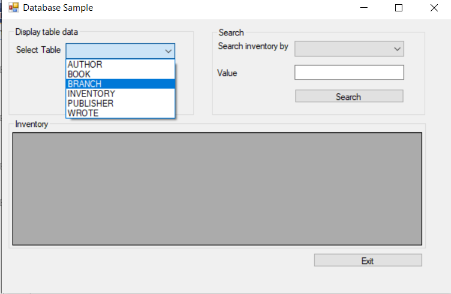
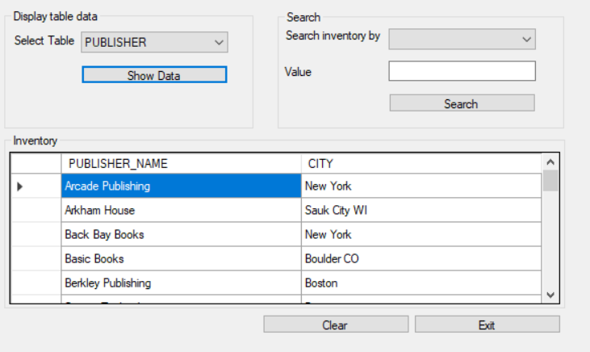
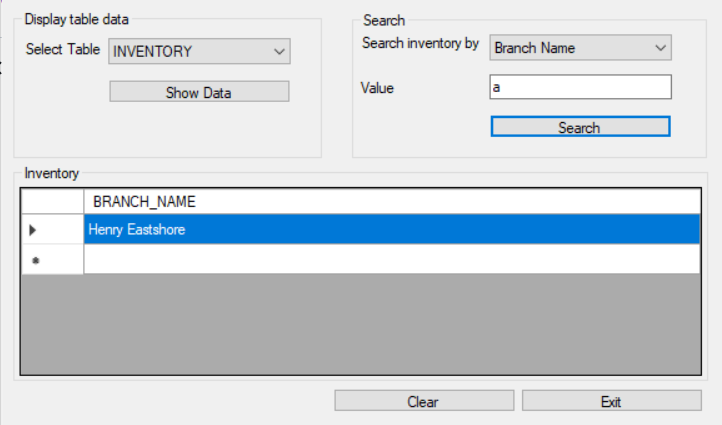

# HBooks
Hbooks is a select screen that provides a GUI that allows the user to retrieve values from multiple tables in a SQL database.
 
## Sample use
Step 1: user selects a type of table they want to see in the "Select Data" dropdown menu

 
Step 2: After hitting the "Show Data" button, the user will see a table corresponding to the value selected in the dropdown menu.

 
Step 3: User can also search for specific values given an input, which will show all the values in the different tables that have the corresponding input in them. In the example below, the screen shows branch names in the database with the letter A in it.
 

### Features
- Dropdown menu with different options that correspond to the SQL tables in the database.
- Textbox that allows the user to type an input upon which the program will display values that have the input value in it.
- Clear button to wipe out the values previously selected in the application.
